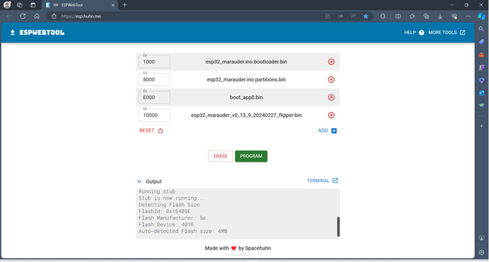
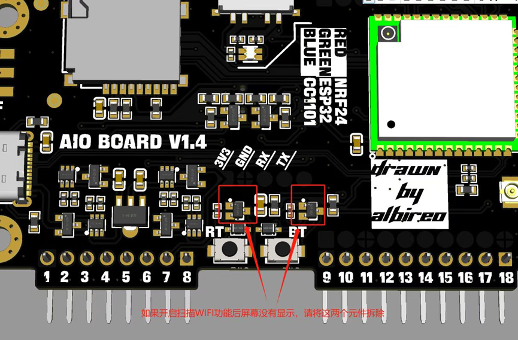

# Installation Instructions

This guide will walk you through updating your AIO board to the latest firmware and installing the Marauder firmware.

## Requirements

- **AIO V1.4 Board**
- **USB Type-C Cable**
- **Computer with a supported browser** (Edge recommended)
- **Firmware file** (available in this repository under `firmware/latest`)

## Steps to Flash Firmware

1. Open [ESP Web Tool](https://huhn.me) in your browser.
2. Turn the toggle switch on the board to the **middle position**.
3. Press and hold the `BOOT` button (labeled **BT**) on the front PCB.
4. Connect the board to your computer via the USB Type-C interface.
   - **Green LED** should be lit.
5. In the ESP Web Tool:
   - Select `ESP32-s2` as the chip.
   - Upload the firmware files from the `firmware/latest` directory.
   - Follow this order
     
6. Click **PROM** to start flashing.
7. Wait for the progress bar to reach 100%. If interrupted:
   - Ensure all connections are secure.
   - Reconnect and retry.

## Optimizing WiFi Scanning

If WiFi scanning is slow, remove the two components highlighted in the provided board diagram (requires soldering).

---

## Notes

- Avoid plugging/unplugging the module while powered on to prevent damage.
- Check the **LED indicators** to confirm the current mode.
