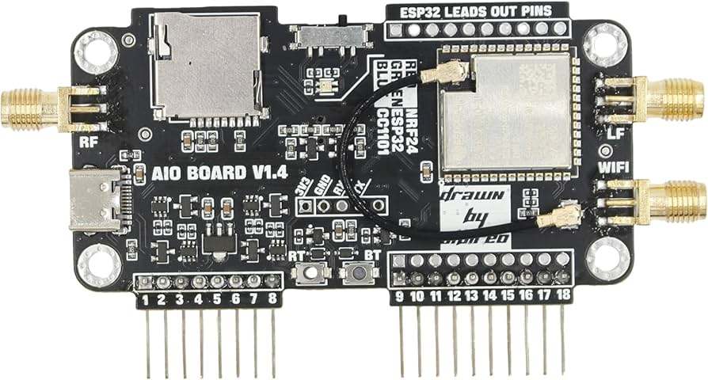

# Flipper Zero AIO Board Firmware

Welcome to the repository for the Flipper Zero AIO Board firmware. This repository provides all the necessary firmware files and instructions to install and use the **Marauder** firmware with your AIO board.

---

## About

  
The Flipper Zero AIO Board expands the capabilities of the Flipper Zero by integrating multiple wireless communication modules, including Wi-Fi, Bluetooth, Sub-GHz, and more. With this firmware, you can unleash the full potential of your device for hacking, prototyping, and development.

---

## Resources and Tutorials

### 1. **Introduction to the AIO Board**

Learn about the features and capabilities of the AIO Board in this detailed introduction:  

### 2. **Firmware Installation**

Follow this step-by-step guide to install the Marauder firmware:  

### 3. **Troubleshooting**

Resolve common issues with this helpful troubleshooting video:  

---

## Related Course

Take your skills to the next level with **The Ultimate Flipper Zero Course: Learn, Hack, Innovate**, available on Udemy. This course dives deep into the capabilities of the Flipper Zero and how to make the most of your AIO board.  

---

## Features

- Sub-GHz Transceivers
- Wi-Fi Capability (ESP32)
- Bluetooth LE (nRF24)
- High-Performance Antennas
- Seamless integration with Flipper Zero

---

## Installation

1. Download the latest firmware release from this repository.
2. Follow the installation instructions in the [Firmware Installation Video](https://youtu.be/Mnv05jEKFvA?si=eikBgnsZXIGSdLAr).
3. Verify your installation with the included troubleshooting tips.

---

## Support

If you encounter any issues or have questions, feel free to open an issue in this repository or consult the troubleshooting video linked above.
